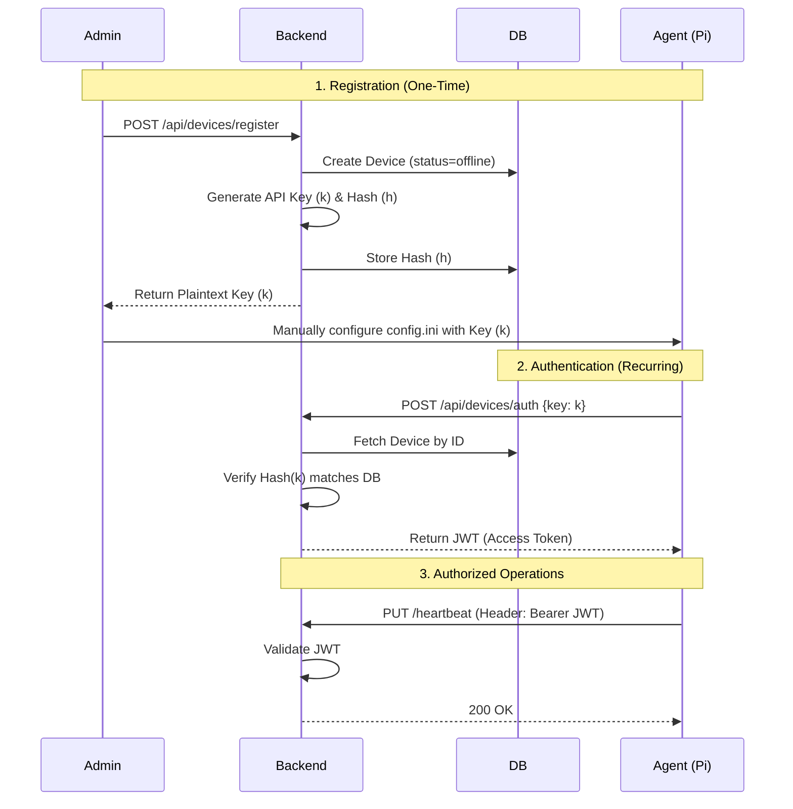

## PHASE 3 DOCUMENTATION: Phase 3: Edge Integration (Weeks 9-10)

### 1. Phase Overview

This phase is the critical link between the software (Phase 2 Builder) and the physical world (the edge devices). In Phase 1, we defined the *concept* of a `Device`. In Phase 2, we *generated* a `python_code` artifact. In this phase, we make the code "cross the wire" and execute on the target hardware.

This phase introduces two new major components:
1.  **The Edge Agent (`edge/agent.py`):** A persistent Python application that runs on the Raspberry Pi.
2.  **The Deployment & Communication (D&C) Service:** A set of new backend APIs and MQTT logic to manage the *deployment* of code and *communication* with the Agent.

The core loop to be built is: User clicks "Deploy" -> Backend tells Agent via MQTT -> Agent fetches the script via API -> Agent runs the script.

#### 1.1 Phase Objectives and Success Criteria

**Objectives:**
* Implement the `edge/agent.py` application to run on the Raspberry Pi.
* Implement the backend logic for device authentication, allowing an agent to get a secure API token.
* Implement a new API endpoint, `POST /api/experiments/{id}/deploy`, to initiate an experiment.
* Implement a new database table, `experiment_deployments`, to track the state of a deployment (e.g., "pending," "running," "completed").
* Use the MQTT broker (from Phase 1) to send a "deploy" command from the backend to the correct Edge Agent.
* Implement a secure API endpoint, `GET /api/experiments/{id}/script`, for the agent to download the `python_code`.
* Implement a `systemd` setup script (`edge/setup.sh`) to easily install the agent on a new Pi.
* Implement a minimal frontend "Deploy" button and modal to trigger this entire flow.
* Implement a backend MQTT listener to receive "status" and "heartbeat" messages from the agent.

**Success Criteria:**
* A developer can provision a new Raspberry Pi with `edge/setup.sh`, and the `agent.py` service starts on boot.
* The `agent.py` successfully connects to the MQTT broker and registers itself.
* A user can log in to the frontend, go to an experiment, and click "Deploy."
* A modal appears, allowing the user to select an "online" device.
* Upon selection, the backend `experiment_deployments` table shows a new "pending" entry.
* The backend publishes a "deploy" message to the correct MQTT topic.
* The `agent.py` on the Pi receives the message, authenticates, and downloads the `python_code` from the `/script` endpoint.
* The agent executes the script using `subprocess`.
* The agent publishes an MQTT status update ("running"), and the `experiment_deployments` table is updated to "running."
* When the script finishes, the agent publishes "completed," and the table is updated.

#### 1.2 Why this phase is sequenced at this point in the project
* **Phase 1 (Foundation)** gave us the `Devices` table, but no way to talk to them.
* **Phase 2 (Builder)** gave us the `python_code` artifact, but no way to run it.
* This phase *consumes* the `python_code` from Phase 2 and uses the `Devices` table from Phase 1 to bridge the final gap to the hardware. It is the logical "next step" to make the project useful.

#### 1.3 Dependencies on previous phases
* **Phase 1 (`Phase_1_Foundation.md`):**
    * **`Devices` Table:** We will be *modifying* this table to add security (`device_api_key`) and status (`status`, `last_seen`).
    * **`docker-compose.yml`:** Relies on the `mqtt` service (Mosquitto) being running.
    * **User Auth:** The *user* must be authenticated to click "Deploy."
* **Phase 2 (`Phase_2_PsychoPy_Builder.md`):**
    * **`experiments.python_code`:** This is the artifact we are deploying. This phase *will not work* if the `/compile` endpoint from Phase 2 is broken.
    * **`experiments` Table:** We read from this table heavily.

#### 1.4 What must be completed before next phase can begin
* A stable, end-to-end "Deploy" loop.
* The `experiment_deployments` table must be reliably tracking the state of tasks.
* The `edge/agent.py` must be publishing *basic* logs and status updates via MQTT.
* **Crucially for Phase 4:** The `agent.py` must be *publishing* trial data (e.g., to `devices/{id}/data`) even if the backend isn't *listening* yet. This provides the "hook" for Phase 4 to build the data ingestion pipeline.

#### 1.5 Estimated Timeline with Buffer Considerations
* **Total:** 2 Weeks (as per Master Doc 16.3)
* **Week 9:** Edge Agent & Backend Comms (MQTT/Auth)
* **Week 10:** API Endpoints, DB, and Frontend UI
* **Buffer:** 0.5 Weeks. The primary risk is hardware/network debugging with the Raspberry Pi and MQTT. This can be a time sink.
* **Total Allotted:** 2.5 Weeks

#### 1.6 Key deliverables and artifacts
* **Backend Code:**
    * New endpoints in `backend/app/api/routes/experiments.py` (`/deploy`, `/script`).
    * New endpoints in `backend/app/api/routes/devices.py` (`/auth`, `/heartbeat`).
    * New model `backend/app/models/experiment_deployment.py`.
    * New CRUD `backend/app/crud/crud_deployment.py`.
    * Modified `backend/app/core/mqtt.py` to include subscription logic.
    * New `backend/app/api/deps.py` for device auth (`get_current_device`).
* **Edge Code (NEW Directory):**
    * `edge/agent.py`
    * `edge/requirements.txt`
    * `edge/setup.sh`
    * `edge/config.ini.example`
* **Database:**
    * New Alembic migration for `experiment_deployments` table and `devices` table modifications.
* **Frontend Code:**
    * New `frontend/src/components/DeployModal.tsx`.
    * Modifications to `frontend/src/app/(dashboard)/builder/[id]/page.tsx` (to add the button).
    * New page `frontend/src/app/(dashboard)/deployments/page.tsx` (to list deployments).

---

### 2. Scope Definition

#### 2.1 What IS included in this phase
* **Backend:**
    * **Device Auth:** A new `device_api_key` column on the `devices` table, populated on registration. A `/api/devices/auth` endpoint for the agent to get a short-lived JWT.
    * **Deployment API:** `POST /api/experiments/{id}/deploy` which creates a `deployment` record and publishes an MQTT "run" command.
    * **Script API:** `GET /api/experiments/{id}/script` protected by device auth, which returns the `python_code`.
    * **MQTT Service:** The backend will *subscribe* to `devices/+/status` and `devices/+/heartbeat` topics to update the `devices` and `experiment_deployments` tables.
* **Edge Agent (`edge/agent.py`):**
    * A `systemd` compatible Python script.
    * On-boot registration (if no API key is saved locally).
    * Device authentication (calling `/auth` with its API key).
    * Persistent MQTT connection with auto-reconnect.
    * Subscription to `devices/{self_id}/command`.
    * Regular heartbeats published to `devices/{self_id}/heartbeat`.
    * Handler for the "run" command:
        1.  **Publishes `ack` to `devices/{self_id}/ack` (QoS 1).**
        2.  Fetches script from `/script`.
        3.  Saves script to a local `.py` file.
        4.  Publishes "running" status.
        5.  Executes script with `subprocess.run()`.
        6.  Publishes "completed" or "failed" status on exit.
    * **Offline Sync Strategy (Store-and-Forward):**
        *   Agent maintains a local SQLite queue (`queue.db`) for trial data.
        *   When `subprocess` finishes, data is written to this local queue.
        *   A background thread checks connectivity every 60s.
        *   If online: Flushes queue to `devices/{self_id}/data` (QoS 1).
        *   If offline: Keeps data in queue until next check.
* **Database:**
    * New `experiment_deployments` table.
    * Migration to add `device_api_key`, `status`, `last_seen` to the `devices` table.
* **Frontend:**
    * A "Deploy" button on the experiment list and/or builder page.
    * A `DeployModal.tsx` that lets the user select an *online* device (fetched from `GET /api/devices`).
    * A new read-only page `/deployments` to view the `experiment_deployments` table.

#### 2.2 What IS NOT included in this phase
* **Data Ingestion:** The agent *will* publish to `devices/{id}/data` (as a "fire and forget"), but the backend *will not* subscribe to this topic or save it to `trial_results`. This is the primary goal of **Phase 4**.
* **Real-time UI Updates:** The `/deployments` page will *not* auto-update via WebSockets. The user will have to refresh the page to see if the status changed from "pending" to "running." Live UI is **Phase 4**.
* **Hardware GPIO Control:** Phase 2 defined a `GPIO Output` component. The generated script *may* contain `gpio.setup()` commands. We *will* include a mock `app.psychopy_ext.gpio` bridge in the `edge/` code, but full hardware testing is deferred. The goal is script *execution*, not peripheral function.
* **Script Sandboxing:** The `agent.py` will execute the downloaded `python_code` with the *same user permissions as the agent*. This is a major security simplification. We are trusting the user's compiled script.
* **Agent Auto-Update:** The `agent.py` cannot be updated remotely. Updating the agent will require a manual `git pull` and restart on the Pi.

---

### 3. Technical Architecture for This Phase

#### 3.1 Component Architecture

**Frontend (Changes):**
* **`Toolbar.tsx` (in builder):**
    * Adds a `<DeployButton />` component.
* **`DeployModal.tsx` (New):**
    * `useQuery(['devices'], () => fetch('/api/devices'))` to get all devices.
    * Filters devices where `device.status === 'online'`.
    * Renders a list.
    * `useMutation((deviceId) => post('/api/experiments/{expId}/deploy', { deviceId }))`
    * On mutation success, `queryClient.invalidateQueries(['deployments'])` and closes.
* **`app/(dashboard)/deployments/page.tsx` (New):**
    * `useQuery(['deployments'], () => fetch('/api/deployments'))`
    * Renders a simple `<table>` of all deployment records.

**Backend (Changes & Additions):**
* **`api/routes/devices.py`:**
    * **MODIFY** `POST /register`: Now generates a `device_api_key`, saves its *hash* in the DB, and returns the *plaintext key* to the agent **one time only**.
    * **NEW** `POST /auth`: Agent posts `{"device_api_key": "..."}`. Backend hashes the key, finds matching `devices` record, and returns a short-lived (1-hour) JWT.
    * **NEW** `PUT /heartbeat`: Agent (using JWT) posts `{"status": "online"}`. Backend updates `devices.last_seen` and `devices.status`.
* **`api/routes/experiments.py`:**
    * **NEW** `POST /{id}/deploy`:
        1.  Auth: `get_current_active_user`.
        2.  Body: `{"device_id": "..."}`.
        3.  Gets `experiment` and `device`.
        4.  Checks `device.status == 'online'`.
        5.  Creates `ExperimentDeployment` record with `status="pending"`.
        6.  Calls `mqtt_client.publish(f"devices/{device_id}/command", '{"action": "run", "experiment_id": "{id}", "deployment_id": "{deployment_id}"}')`.
        7.  Returns 202 Accepted.
    * **NEW** `GET /{id}/script`:
        1.  Auth: `get_current_device` (new dependency, checks device JWT).
        2.  Fetches `experiment`.
        3.  Returns `{"python_code": experiment.python_code}`.
* **`core/mqtt.py`:**
    * On app startup, the MQTT client will now also `subscribe("devices/+/status")`.
    * An `on_message` handler is added.
    * `def on_status_message(topic, payload)`:
        1.  Parses `device_id` from topic.
        2.  Parses `payload` JSON (e.g., `{"status": "running", "deployment_id": "..."}`).
        3.  Uses a `db_session` to find the `ExperimentDeployment` and update its `status`.
        4.  If `payload.status` is "running", set `started_at`.
        5.  If `payload.status` is "completed" or "failed", set `completed_at`.
    * **NEW** `def on_ack_message(topic, payload)`:
        *   Updates `ExperimentDeployment` to indicate "Command Received" (optional, but good for debugging).
    * **Reliability:** All publications to `devices/+/command` must use **QoS 1** (At Least Once).

**Edge (`edge/` Directory - ALL NEW):**
* **`agent.py`:**
    * **Main Class:** `EdgeAgent`.
    * **`config.ini`:** Stores `backend_url`, `mqtt_broker`, `mqtt_port`, `device_id`, `device_api_key`.
    * **`__init__`:** Loads config. Sets up `paho-mqtt` client, sets `on_connect`, `on_message`.
    * **`run_forever`:** Calls `connect()` and `loop_forever()`.
    * **`register`:** Called if `device_api_key` is missing.
        1.  Gets MAC address (`device_id`).
        2.  `POST /api/devices/register` with `{"device_id": "...", "name": "Pi-..."}`.
        3.  Saves returned `device_api_key` to `config.ini`.
    * **`authenticate`:**
        1.  `POST /api/devices/auth` with `device_api_key`.
        2.  Saves returned `jwt_token`.
        3.  Schedules `authenticate()` to run again in 55 minutes.
    * **`start_heartbeat`:** Uses `threading.Timer` to call `PUT /api/devices/heartbeat` every 30 seconds.
    * **`on_connect`:** Subscribes to `devices/{self.device_id}/command`.
    * **`on_message`:**
        1.  Parses `payload` JSON.
        2.  If `action == 'run'`: calls `self.run_experiment(payload)`.
    * **`run_experiment(payload)`:**
        1.  `exp_id = payload['experiment_id']`
        2.  `dep_id = payload['deployment_id']`
        3.  `self.publish_status(dep_id, "running")`
        4.  `code = self.fetch_script(exp_id)`
        5.  `save_path = f"/tmp/{exp_id}.py"`
        6.  `with open...` saves code.
        7.  `result = subprocess.run(["python3", save_path], ...)`
        8.  If `result.returncode == 0`: `self.publish_status(dep_id, "completed")`
        9.  Else: `self.publish_status(dep_id, "failed", error=result.stderr)`
    * **`fetch_script(exp_id)`:**
        1.  `GET /api/experiments/{exp_id}/script` with `Authorization: Bearer {self.jwt_token}`.
        2.  Returns `response.json()['python_code']`.
    * **`publish_status(dep_id, status, ...)`:**
        1.  `self.mqtt.publish(f"devices/{self.device_id}/status", '{"deployment_id": "...", "status": "..."}')`

#### 3.2 Data Architecture

* **Tables to Modify:**
    * `devices` (from Phase 1):
        * `ADD COLUMN status "DeviceStatus" DEFAULT 'offline' NOT NULL` (Enum: "online", "offline", "running").
        * `ADD COLUMN last_seen TIMESTAMP WITH TIME ZONE`.
        * `ADD COLUMN device_api_key_hash TEXT UNIQUE`.
* **Tables to Add:**
    * `experiment_deployments`:
        * `id`: UUID (Primary Key)
        * `experiment_id`: UUID (Foreign Key to `experiments.id`)
        * `device_id`: UUID (Foreign Key to `devices.id`)
        * `status`: "DeploymentStatus" (Enum: "pending", "running", "completed", "failed")
        * `deployed_at`: `TIMESTAMP` (When the user clicked "Deploy")
        * `started_at`: `TIMESTAMP` (When agent reported "running")
        * `completed_at`: `TIMESTAMP` (When agent reported "completed"/"failed")
        * `error_log`: `TEXT` (If status is "failed")

* **Migration Scripts:**
    * `docker-compose exec backend alembic revision -m "Add experiment_deployments table and modify devices"`
    * The migration file will:
        1.  Create the `DeploymentStatus` enum.
        2.  Create the `experiment_deployments` table.
        3.  Create indexes on `experiment_id` and `device_id`.
        4.  Create the `DeviceStatus` enum.
        5.  Add `status`, `last_seen`, `device_api_key_hash` columns to `devices`.

#### 3.3 Technology Stack
* **Backend (New):**
    * `paho-mqtt`: Already in `requirements.txt` from Phase 1, but now we *use* it for subscribing.
    * `passlib`: For hashing the `device_api_key`.
* **Edge (NEW):**
    * `python3.11` (or whatever is on the Pi).
    * `paho-mqtt`: For MQTT communication.
    * `requests`: For API calls.
    * `systemd`: For process management (via `.service` file).

---

### 4. Detailed Implementation Plan

#### 4.1 Week-by-Week Breakdown

* **Week 9 Objectives: Edge Agent & Backend Comms (MQTT/Auth)**
    * **Tasks:**
        1.  **DB:** Create and apply the Alembic migration for `devices` and `experiment_deployments`.
        2.  **Backend:** Implement the `POST /api/devices/register` modification (generate/hash key).
        3.  **Backend:** Implement `POST /api/devices/auth` (return JWT).
        4.  **Backend:** Implement `PUT /api/devices/heartbeat` (update `last_seen`).
        5.  **Edge:** Create `edge/agent.py`.
        6.  **Edge:** Implement agent's `register()`, `authenticate()`, and `start_heartbeat()` methods.
        7.  **Edge:** Create `edge/setup.sh` to install `paho-mqtt`, `requests`, and copy a template `config.ini`.
        8.  **Backend:** Implement `core/mqtt.py` subscription to `devices/+/status` and a basic `on_message` handler that just `logger.info()` the message.
    * **Outputs:** A running Pi that authenticates, sends heartbeats, and whose status messages appear in the backend log.
    * **Checkpoints:** Can you run `setup.sh` on a Pi? Does the `agent.py` start? Does the `devices` table show `status="online"` and a recent `last_seen`?

* **Week 10 Objectives: API Endpoints, DB, and Frontend UI**
    * **Tasks:**
        1.  **Backend:** Implement `POST /api/experiments/{id}/deploy`.
        2.  **Backend:** Implement `GET /api/experiments/{id}/script` with `deps.get_current_device` auth.
        3.  **Backend:** F-lesh out the `on_status_message` handler to *update* the `experiment_deployments` table.
        4.  **Edge:** Implement the agent's `on_message` handler to parse the "run" command.
        5.  **Edge:** Implement `run_experiment()` logic (fetch, save, `subprocess.run`, publish status).
        6.  **Frontend:** Build the `DeployModal.tsx`.
        7.  **Frontend:** Add the "Deploy" button to the UI.
        8.  **Frontend:** Build the `/deployments` list page.
        9.  **E2E Test:** Run the full success criteria (1.1).
    * **Outputs:** The full deployment loop is functional.
    * **Checkpoints:** Can a user click "Deploy" and see the `python_code` execute (e.g., `print("Hello from Pi")`) on the Pi? Does the `/deployments` page update (on refresh) from "pending" to "running" to "completed"?

---

### 5. API and Interface Specifications

#### 5.1 Device Authentication Flow (Sequence Diagram)



* **Endpoint:** `POST /api/devices/register` (Modified)
    * **Purpose:** Register a new Pi. Returns a *one-time* API key.
    * **Auth:** None (relies on network isolation, as per Phase 1).
    * **Request:** `{"device_id": "b8:27:eb:xx:xx:xx", "name": "Cage 01 Pi"}`
    * **Response (201):**
        ```json
        {
          "id": "f1g2h3j4-...",
          "device_id": "b8:27:eb:xx:xx:xx",
          "name": "Cage 01 Pi",
          "status": "offline",
          "device_api_key": "LICS_KEY_THIS_IS_THE_PLAINTEXT_KEY_SAVE_IT_NOW"
        }
        ```
    * **Backend Logic:**
        1.  `key = secrets.token_urlsafe(32)`
        2.  `hash = get_password_hash(key)`
        3.  `db_device.device_api_key_hash = hash`
        4.  Save `db_device`.
        5.  Return `key` (not hash).

* **Endpoint:** `POST /api/devices/auth` (NEW)
    * **Purpose:** For an agent to exchange its long-lived API key for a short-lived JWT.
    * **Auth:** None.
    * **Request:** `{"device_api_key": "LICS_KEY_..."}`
    * **Response (200):**
        ```json
        {
          "access_token": "ey...[JWT]...",
          "token_type": "bearer"
        }
        ```
    * **Backend Logic:**
        1.  Find `device` where `verify_password(request.device_api_key, device.device_api_key_hash)`.
        2.  If not found, `raise 401`.
        3.  `jwt_payload = {"sub": str(device.id), "scope": "device"}`
        4.  `token = create_access_token(data=jwt_payload, expires_delta=timedelta(hours=1))`
        5.  Return token.

* **Endpoint:** `PUT /api/devices/heartbeat` (NEW)
    * **Purpose:** For an agent to check in and update its status.
    * **Auth:** `Depends(get_current_device)` (Device-scoped JWT).
    * **Request:** `{"status": "online"}`
    * **Response (200):** `{"status": "ok"}`
    * **Backend Logic:**
        1.  `device = get_current_device` (from JWT).
        2.  `device.status = "online"`
        3.  `device.last_seen = datetime.utcnow()`
        4.  Save `device`.

* **Endpoint:** `POST /api/experiments/{id}/deploy` (NEW)
    * **Purpose:** For a *user* to trigger an experiment on a device.
    * **Auth:** `Depends(get_current_active_user)` (User-scoped JWT).
    * **Request:** `{"device_id": "f1g2h3j4-..."}`
    * **Response (202):**
        ```json
        {
          "id": "dep_a1b2...",
          "experiment_id": "exp_c3d4...",
          "device_id": "f1g2h3j4-...",
          "status": "pending",
          "deployed_at": "2025-11-20T10:00:00Z"
        }
        ```

* **Endpoint:** `GET /api/experiments/{id}/script` (NEW)
    * **Purpose:** For an *agent* to download the compiled code.
    * **Auth:** `Depends(get_current_device)` (Device-scoped JWT).
    * **Request:** (None)
    * **Response (200):**
        ```json
        {
          "python_code": "# Auto-generated by LICS...\nfrom psychopy import core\n..."
        }
        ```

* **MQTT Topic:** `devices/{device_id}/command`
    * **Direction:** Backend -> Agent
    * **Payload:**
        ```json
        {
          "action": "run",
          "experiment_id": "exp_c3d4...",
          "deployment_id": "dep_a1b2..."
        }
        ```

* **MQTT Topic:** `devices/{device_id}/status`
    * **Direction:** Agent -> Backend
    * **Payload (Running):**
        ```json
        {
          "deployment_id": "dep_a1b2...",
          "status": "running"
        }
        ```
    * **Payload (Completed):**
        ```json
        {
          "deployment_id": "dep_a1b2...",
          "status": "completed"
        }
        ```
    * **Payload (Failed):**
        ```json
        {
          "deployment_id": "dep_a1b2...",
          "status": "failed",
          "error": "Traceback (most recent call last): ... File \"<string>\", line 5, in <module> ... "
        }
        ```

---

### 6. User Interface Specifications

* **Component:** `DeployButton` (in `Toolbar.tsx` or `ExperimentList.tsx`)
    * **Visual:** A button with a "Deploy" icon (e.g., Rocket).
    * **Interactions:** `onClick` opens the `DeployModal`.
    * **State:** Receives `experimentId` as a prop.

* **Component:** `DeployModal.tsx`
    * **Purpose:** Allow user to select an available device.
    * **Visual:** A modal dialog.
        * Title: "Deploy Experiment: {exp_name}"
        * `useQuery` fetches `GET /api/devices`.
        * Displays a "Loading devices..." spinner.
        * Displays an error message if fetch fails.
        * Renders a list/radio group of devices, *filtered* by `device.status === 'online'`.
        * If no online devices, shows "No online devices found."
        * A "Deploy" button (disabled until a device is selected) and "Cancel" button.
    * **Interactions:**
        * `onChange` on list/radio group updates local `selectedDevice` state.
        * "Deploy" button click triggers `useMutation` to `POST /api/experiments/{id}/deploy` with `{"device_id": selectedDevice}`.
        * While mutation is `isLoading`, show spinner on button.
        * On success, show success toast ("Deployment started!"), invalidate "deployments" query, and close modal.
        * On error, show error toast.

* **Component:** `DeploymentsList` (`app/(dashboard)/deployments/page.tsx`)
    * **Purpose:** Show the history and status of all deployments.
    * **Visual:** A full-page component.
        * Title: "Deployments"
        * `useQuery` fetches `GET /api/deployments` (new endpoint needed).
        * Renders a `<table>` with columns:
            * Experiment Name (requires join in backend)
            * Device Name (requires join in backend)
            * Status (e.g., `<Badge color="blue">pending</Badge>`)
            * Deployed At (timestamp)
            * Started At (timestamp)
            * Completed At (timestamp)

---

### 7. Database Implementation

#### 7.1 Schema Design
* **Enum (SQL):** `CREATE TYPE "DeviceStatus" AS ENUM ('online', 'offline', 'running');`
* **Enum (SQL):** `CREATE TYPE "DeploymentStatus" AS ENUM ('pending', 'running', 'completed', 'failed');`

* **`devices` (ALTER TABLE):**
    ```sql
    ALTER TABLE devices
        ADD COLUMN status "DeviceStatus" NOT NULL DEFAULT 'offline',
        ADD COLUMN last_seen TIMESTAMPTZ,
        ADD COLUMN device_api_key_hash TEXT;
    
    CREATE UNIQUE INDEX ix_devices_device_api_key_hash ON devices(device_api_key_hash);
    ```

* **`experiment_deployments` (CREATE TABLE):**
    ```sql
    CREATE TABLE experiment_deployments (
        id UUID NOT NULL,
        experiment_id UUID NOT NULL,
        device_id UUID NOT NULL,
        status "DeploymentStatus" NOT NULL DEFAULT 'pending',
        deployed_at TIMESTAMPTZ NOT NULL DEFAULT now(),
        started_at TIMESTAMPTZ,
        completed_at TIMESTAMPTZ,
        error_log TEXT,
        PRIMARY KEY (id),
        FOREIGN KEY(experiment_id) REFERENCES experiments (id) ON DELETE CASCADE,
        FOREIGN KEY(device_id) REFERENCES devices (id) ON DELETE CASCADE
    );

    CREATE INDEX ix_experiment_deployments_experiment_id ON experiment_deployments (experiment_id);
    CREATE INDEX ix_experiment_deployments_device_id ON experiment_deployments (device_id);
    ```

#### 7.2 Migration Strategy
1.  Run `docker-compose exec backend alembic revision -m "Add deployments table and device auth"`
2.  Copy the generated DDL (from 7.1, but in SQLAlchemy/Alembic syntax) into the new migration file.
    * `op.create_enum('DeviceStatus', ...)`
    * `op.create_enum('DeploymentStatus', ...)`
    * `op.create_table('experiment_deployments', ...)`
    * `op.add_column('devices', sa.Column('status', ...))`
    * (etc.)
3.  Run `docker-compose exec backend alembic upgrade head` to apply.
4.  **Rollback:** `docker-compose exec backend alembic downgrade -1`.

---

### 8. Testing Strategy for This Phase

#### 8.1 Unit Testing
* **Target (Backend):**
    * `api/routes/devices.py`: Test the `/register` logic (does it return a key and store a *different* hash?). Test `/auth` with correct and incorrect keys.
    * `core/mqtt.py`: Test the `on_status_message` parser (e.g., `test_parses_running_status`, `test_parses_failed_status`).
* **Target (Edge):**
    * `agent.py`: Test `on_message` handler logic (e.g., `test_ignores_unknown_action`). Test `run_experiment` logic *with a mocked `subprocess.run`*.

#### 8.2 Integration Testing
* **Target:** `POST /deploy` -> MQTT -> `on_status_message`.
    * **Strategy:** Use `pytest` with the `client` fixture and a *real* MQTT broker (from `docker-compose.yml`).
    * `test_deploy_flow`:
        1.  Create `user`, `experiment`, `device`.
        2.  Auth as `user`, call `POST /deploy` with `device.id`.
        3.  Assert `experiment_deployments` table has 1 "pending" row.
        4.  In the test, use `paho-mqtt` to *publish* a `devices/{device.id}/status` message ("running").
        5.  `time.sleep(1)`.
        6.  Check DB: Assert row status is now "running".
* **Target:** `agent.py` script fetch.
    * **Strategy:** Manually run `agent.py`. Call `POST /deploy`. Watch the agent's console output. Verify it prints "Fetching script..." and then "Running script...".

#### 8.3 End-to-End Testing
* **Scenario:** The "Happy Path" (from 1.1 Success Criteria).
    * (Manual) Set up a real Pi.
    * Run `setup.sh`.
    * Log in to UI.
    * Create/Compile experiment (MVP: Text + Keyboard).
    * Click "Deploy," select the Pi.
    * Go to `/deployments` page, refresh, and watch status change (pending -> running -> completed).
    * Check Pi `systemd` logs: `journalctl -u lics-agent.service -f`.

---

### 9. Security Implementation

* **Authentication (User):** The `/deploy` endpoint is protected by `deps.get_current_active_user`, ensuring only logged-in users can start tasks.
* **Authentication (Device):** This is the **critical** implementation.
    1.  **Key at Rest:** The `device_api_key` is *hashed* in the DB using `passlib`. A plaintext key is *never* stored on the server.
    2.  **Key in Transit (Initial):** The agent receives the *plaintext* key on registration. This relies on the Phase 1 assumption of network isolation.
    3.  **Token Auth:** The agent exchanges this static, long-lived key for a *scoped, short-lived JWT* via `POST /api/devices/auth`.
    4.  **Endpoint Protection:** The `/script` and `/heartbeat` endpoints **must** use a new dependency `deps.get_current_device` that validates this "device" scoped JWT. A *user* JWT must not be able to call these endpoints.
    5.  **Token Validation:** All data ingestion endpoints (Phase 4) must also validate this JWT to ensure data is coming from a legitimate device.
* **Authorization:**
    * The `POST /deploy` endpoint **must** check that `experiment.created_by == current_user.id`. A user cannot deploy another user's experiment.
* **Code Injection Risk (From Phase 2):** The `agent.py` executes code from the DB. We are explicitly *accepting* this risk. The mitigation is that a user must be authenticated to *create* the code (Phase 2) and to *deploy* it (Phase 3). We are trusting our authenticated users.
* **Data Validation:** All MQTT payloads must be wrapped in `try...except` blocks to handle malformed JSON.

---

### 10. DevOps and Infrastructure

#### 10.1 Environment Setup
* **`edge/setup.sh` (NEW):**
    ```bash
    #!/bin/bash
    echo "Installing LICS Edge Agent..."
    sudo apt-get update
    sudo apt-get install python3-pip python3-venv -y
    
    # Setup venv
    python3 -m venv /opt/lics-agent
    /opt/lics-agent/bin/pip install paho-mqtt requests
    
    # Copy agent code (assumes user cloned repo to ~/)
    sudo cp ~/lics/edge/agent.py /opt/lics-agent/
    
    # Create config
    read -p "Enter Backend URL (e.g., [http://192.168.1.100:8000](http://192.168.1.100:8000)): " backend_url
    # ... (ask for MQTT broker, etc.)
    echo -e "[default]\nbackend_url = $backend_url\n..." | sudo tee /opt/lics-agent/config.ini
    
    # Setup systemd service
    sudo tee /etc/systemd/system/lics-agent.service > /dev/null <<EOF
    [Unit]
    Description=LICS Edge Agent
    After=network.target
    
    [Service]
    User=pi
    WorkingDirectory=/opt/lics-agent
    ExecStart=/opt/lics-agent/bin/python3 agent.py
    Restart=always
    
    [Install]
    WantedBy=multi-user.target
    EOF
    
    sudo systemctl daemon-reload
    sudo systemctl enable lics-agent.service
    sudo systemctl start lics-agent.service
    echo "LICS Agent installed and started."
    ```

#### 10.2 CI/CD Pipeline
* Add a new job to the GitHub Action:
    ```yaml
    lint-edge:
      runs-on: ubuntu-latest
      steps:
        - uses: actions/checkout@v3
        - uses: actions/setup-python@v4
          with:
            python-version: '3.11'
        - run: pip install ruff black
        - run: ruff check edge/
        - run: black --check edge/
    ```

---

### 11. Code Organization and Standards

* **New Top-Level Directory:**
    ```
    lics/
    ├── backend/
    ├── frontend/
    └── edge/              <-- NEW
        ├── agent.py
        ├── config.ini.example
        ├── requirements.txt
        └── setup.sh
    ```
* **Backend Additions:**
    ```
    backend/app/
    ├── models/
    │   └── experiment_deployment.py  <-- NEW
    ├── crud/
    │   └── crud_deployment.py      <-- NEW
    ├── api/
    │   └── deps.py                 <-- MODIFIED (add get_current_device)
    ```

---

### 13. Risk Management

* **Technical Risk 1: MQTT Unreliability**
    * **Likelihood:** High. Network drops, broker restarts.
    * **Mitigation:** `paho-mqtt` has built-in `reconnect()` logic. We will use QoS 1 for commands to ensure "at least once" delivery. The agent's heartbeat/status `PUT` provides a secondary check.
* **Technical Risk 2: `subprocess.run()` Hangs**
    * **Likelihood:** Medium. A bad PsychoPy script could freeze.
    * **Mitigation:** `subprocess.run()` should be called with a `timeout` (e.g., 2 hours). If it times out, the agent will kill the process and publish a "failed" status.
* **Technical Risk 3: Device "Orphaning"**
    * **Likelihood:** Medium. Agent `POSTs /deploy`, then Pi loses power. Backend shows "pending" forever.
    * **Mitigation:** The `PUT /heartbeat` is the fix. The backend can have a background task (Phase 4) that sweeps for devices with `last_seen > 5 minutes` and sets their `status` to "offline." The UI should *not* allow deploying to an "offline" device.
* **Technical Risk 4: Data Loss During Outage**
    * **Likelihood:** High. Lab networks are flaky.
    * **Mitigation:** **Store-and-Forward**. The Agent must not delete data until it confirms successful upload (or in Phase 3, successful flush to queue).
* **Technical Risk 5: Command Loss**
    * **Likelihood:** Medium.
    * **Mitigation:** **MQTT QoS 1** + Application Level ACK. The backend will retry sending the "run" command if the broker doesn't acknowledge, and the agent sends an explicit `ack` message.

---

### 14. Phase Completion Checklist
* [ ] Alembic migration for `devices` and `experiment_deployments` is created and tested.
* [ ] `edge/setup.sh` successfully provisions a new Pi.
* [ ] `lics-agent.service` starts on boot and survives reboots.
* [ ] Agent registers (if needed), authenticates, and its `status` becomes "online" in the DB.
* [ ] User can click "Deploy" and select the online device.
* [ ] `experiment_deployments` table shows "pending."
* [ ] Agent log shows "run" command received.
* [ ] Agent log shows script downloaded and executed.
* [ ] `experiment_deployments` table (on refresh) shows "running."
* [As a next step, would you like me to generate the documentation for Phase 4: Data & Deployment, or would you like to refine any part of this document?] After script finishes, table (on refresh) shows "completed."
* [ ] `pytest` suite for new backend logic passes.

---

### 17. Handoff to Next Phase

* **To: Phase 4 (Data & Deployment) Team**
* **What is provided:**
    * A fully functional "deployment" system. Experiments are now *running* on devices.
    * A `experiment_deployments` table tracks *which* experiment ran *where* and *when*.
    * The `edge/agent.py` is now executing the `python_code`.
    * **Crucially:** The `python_code` (from Phase 2) and `agent.py` (from Phase 3) are *already* publishing data. The `python_code` has `print()` statements (which become `device_logs`) and the PsychoPy code *should* be saving data (which becomes `trial_results`). The `agent.py` is configured to publish anything from `stdout` to `devices/{id}/logs` and will be modified to publish data to `devices/{id}/data`.
* **Your (Phase 4) Objective:**
    * The data is flowing, but you are not *catching* it.
    * You must modify `backend/app/core/mqtt.py` to *also* subscribe to:
        * `devices/+/data`
        * `devices/+/logs`
    * You must create the `trial_results` and `device_logs` tables (Master Doc 7.1).
    * Your `on_message` handler for these topics will parse the incoming JSON and save it to the database.
    * You will also build the "Data Visualization" UI to read from these tables.
    * You will implement the WebSocket integration to make the UI update in real-time, using the MQTT events as the *trigger* to push a WebSocket message.
    * **CRITICAL:** Your data ingestion endpoints must validate the **Device JWT** (implemented in Phase 3) to ensure data integrity. Do not accept data from unauthenticated sources.